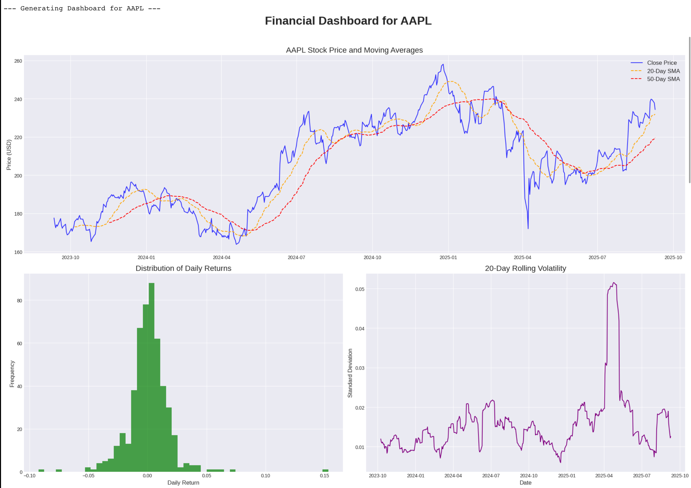

# Stock-Market-Visualisation
A Python script that downloads, analyzes, and visualizes historical stock market data to provide key financial insights. This tool is designed to fetch data for specified stock tickers, calculate important technical indicators, and generate a multi-plot dashboard for easy analysis.
This project was built to demonstrate foundational skills in data acquisition, time-series analysis, and financial data visualization using Python.

# Project features
• Dynamic Data Fetching: Downloads the latest 2 years of stock data from the Yahoo Finance API using the yfinance library.
• Technical Indicator Calculation: Automatically computes key financial indicators:
• 20-Day Simple Moving Average (SMA)
• 50-Day Simple Moving Average (SMA)
• Daily Percentage Returns
• 20-Day Rolling Volatility (as a measure of risk)
• Comprehensive Visualization: For each stock, it generates a multi-panel dashboard using matplotlib that includes:
1. Price and Moving Averages: A line chart of the stock's closing price against its 20-day and 50-day SMAs to identify trends.
2. Distribution of Daily Returns: A histogram showing the frequency and distribution of daily returns, useful for understanding volatility.
3. Rolling Volatility: A time-series plot of the stock's 20-day volatility to analyze changes in risk over time.

# Sample dashboard output
Here is an example of the dashboard generated for the Apple Inc. (AAPL) ticker.

# Technologies used.
• Python 3
• Pandas: For data manipulation, time-series analysis, and indicator calculations.
• yfinance: As the API client to fetch historical market data from Yahoo Finance.
• Matplotlib: For creating the static data visualizations and dashboards.
• NumPy: For numerical operations (used as a dependency by pandas).

# How to Run This Project
This script is designed to be self-contained and easy to run in any environment that supports Python, including local machines and Google Colab.
Instructions:
1. Click on the badge below
2. In the Colab notebook, click Runtime from the top menu.
3. Select Run all. The script will automatically install any missing libraries( and then run from top to bottom, displaying the output plots directly in the notebook.

